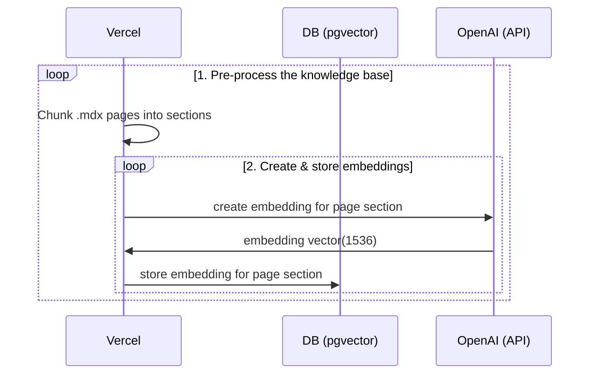
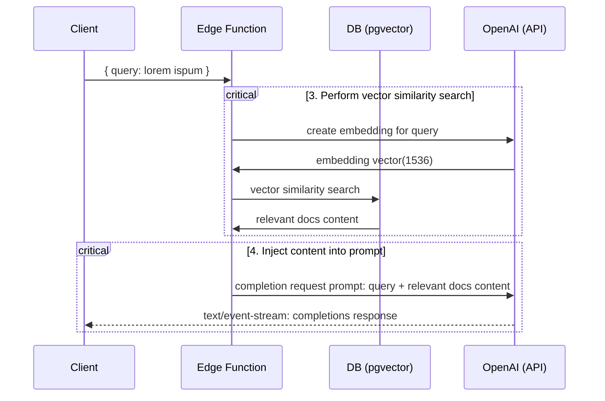

# Next.js OpenAI Doc Search Starter

This starter takes all the `.mdx` files in the `pages` directory and processes them to use as custom context within [OpenAI Text Completion](https://platform.openai.com/docs/guides/completion) prompts.

## Technical Details

Building your own custom ChatGPT involves four steps:

1. [👷 Build time] Pre-process the knowledge base (your `.mdx` files in your `pages` folder).
2. [👷 Build time] Store embeddings in Postgres with [pgvector](https://supabase.com/docs/guides/database/extensions/pgvector).
3. [🏃 Runtime] Perform vector similarity search to find the content that's relevant to the question.
4. [🏃 Runtime] Inject content into OpenAI GPT-3 text completion prompt and stream response to the client.

## 👷 Build time

Step 1. and 2. happen at build time, e.g. when Vercel builds your Next.js app. During this time the [`generate-embeddings`](./lib/generate-embeddings.ts) script is being executed which performs the following tasks:



In addition to storing the embeddings, this script generates a checksum for each of your `.mdx` files and stores this in another database table to make sure the embeddings are only regenerated when the file has changed.

## 🏃 Runtime

Step 3. and 4. happen at runtime, anytime the user submits a question. When this happens, the following sequence of tasks is performed:



The relevant files for this are the [`SearchDialog` (Client)](./components/SearchDialog.tsx) component and the [`vector-search` (Edge Function)](./pages/api/vector-search.ts).

The initialization of the database, including the setup of the `pgvector` extension is stored in the [`supabase/migrations` folder](./supabase/migrations/) which is automatically applied to your local Postgres instance when running `supabase start`.

## Local Development

### Configuration

- `cp .env.example .env`
- Set your `OPENAI_KEY` in the newly created `.env` file.
- Set `NEXT_PUBLIC_SUPABASE_ANON_KEY` and `SUPABASE_SERVICE_ROLE_KEY` run:
  > Note: You have to run supabase to retrieve the keys.

### Start Supabase

Make sure you have Docker installed and running locally. Then run

```bash
supabase start
```

To retrieve `NEXT_PUBLIC_SUPABASE_ANON_KEY` and `SUPABASE_SERVICE_ROLE_KEY` run:

```bash
supabase status
```

### Start the Next.js App

In a new terminal window, run

```bash
pnpm dev
```

### Using your custom .mdx docs

1. By default your documentation will need to be in `.mdx` format. This can be done by renaming existing (or compatible) markdown `.md` file.
2. Run `pnpm run embeddings` to regenerate embeddings.
   > Note: Make sure supabase is running. To check, run `supabase status`. If is not running run `supabase start`.
3. Run `pnpm dev` again to refresh NextJS localhost:3000 rendered page.
